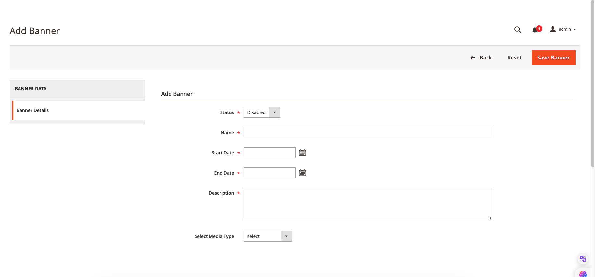

# Magento 2- Banner Slider Extention Free by Yudiz Solutions LTD.

The Magento 2 Banner Slider is a fantastic marketing tool that empowers online store owners to showcase an unlimited number of captivating banner sliders on their Ecommerce website. This delightful extension is designed to captivate the attention of customers and enhance their online shopping experience with its user-friendly interface.

The Magento 2 Banner Slider Module not only allows you to create engaging banner sliders but also provides the flexibility to include various media types. With this module, you can effortlessly add not only images but also videos, including YouTube videos, to your banner sliders. This feature adds a dynamic and interactive element to your website, making it a versatile tool for showcasing your content and captivating your audience.

The BannerSlider Extension comes equipped with its own GraphQL functionality, which can be identified under the name "YudizBannerSlider."

## 1. Key Points

- Installation
- Highlight features of Magento 2 Banner Slider
- Additional Features
- Full features of Banner Slider
- Magento 2 Banner Slider User Guide (ADMIN)
- Magento 2 Banner Slider User Guide (FRONTEND)

## 2.Installation

You can install the Yudiz BannerSlider Extension using one of two methods: via Composer or by downloading it directly from the available source.

### 2.1  Install via composer

To install the Yudiz BannerSlider Extension via Composer, follow these steps in your Magento 2 root folder:

Run the following command:
```shell
composer require yudiz/banner-slider-extension
```
After a successful installation, execute the following commands:

```shell
php bin/magento setup:upgrade
php bin/magento setup:di:compile
php bin/magento setup:static-content:deploy
php bin/magento c:c
php bin/magento c:f
```

With these steps completed, you'll be ready to utilize the Yudiz BannerSlider Extension.

### 2.2 Downlod Directly

you can download the module directly from the following link:

[](https://packagist.org/packages/mageplaza/module-banner-slider)

After successfully downloading the module, follow these steps to install it:

1.Unzip the downloaded folder.

2.Place the unzipped extension folder into the following path:

```shell
project-root-directory/app/code/
```

Indeed, after placing the extension folder in the specified directory, follow these Magento commands to complete the installation:
```shell
php bin/magento setup:upgrade
php bin/magento setup:di:compile
php bin/magento setup:static-content:deploy
php bin/magento c:c
php bin/magento c:f
```

By following these 2 Ways you can easily obtain and install the module.  For detailed instructions on its usage, refer to the user guide within this document.

## 3. Highlight features of Magento 2 Banner Slider

### Endless Banners and Sliders Options

The Banner Slider Extension provides store owners with the incredible capability to upload an unlimited number of banners effortlessly.This versatile tool offers support for a wide range of image formats, such as .jpg, .jpeg, .gif,.mp4 and .png, ensuring flexibility in your design choices.

Furthermore, this extension takes it a step further by enabling you to upload videos, including .mp4 and .gif files, providing an engaging multimedia experience for your website visitors. You can also seamlessly integrate YouTube links into your content. This comprehensive feature set allows you to create captivating and interactive banner sliders that enhance your website's appeal and engagement.

### Optional animation effects to show Slider

Animation effects can considerably better the Sliders' appearance, and make them appealing to customers. Banner Slider module by Yudiz BannerSlider support 9 available slider effects including:

- Slider 
- Auto Slide
- Slide (R to L)
- Set AutoPlay Timeout(seconds)
- Reverse Slide(L to R)
- Show Previous/Next Button
- Show Dots Navigation Button
- Set Slider Margin
- Fade In
- Fade Out

## 4. Additional Features

#### Grid-Based Management

View and edit Banners easily in management grids.

#### URL in Banner 

Associate a URL with each Banner, allowing for seamless navigation to a new tab upon clicking.

#### Time Duration Settings for Slider

Adjust the time period for which you wish to showcase a specific banner before it transitions to the next slide..

#### Activate Hover-Triggered Autoplay

Implement a feature that triggers autoplay when hovering over the video or YouTube video, while automatically pausing it when the cursor is no longer over the video.


## 5. Full features of Banner Slider

### For store admins

#### General Configuration

- Enable/disable the module

#### Banner Configuration

- Add new Banners
- Identify the Banner
- Name of the Banner
- Description of the Banner
- Enable/disable the Banner
- Optional types of MediaType: Image/Video/Youtube Video
- Insert MediaType as a Banner
- Edit or add Images/Video/Youtube Video for Banners by Editor
- Add URL to a banner
- In Banners Grid Images/Video/Youtube Video when click on it it will redirect to the new page
- Add/Update/Delete all Banners in a grids

#### Slider Configuration  

- Add new Slider
- Enable/disable Slider
- Name of the Slider
- Description of the Slider
- Set animation effects 
-  Set Options of animation As per Your Requirements for Auto Play,Set AutoPlay Timeout(seconds),Reverse Slide(L to R),Show Previous/Next Button,Set Slider Margin,Fade In/Fade Out Effect 
- Select Banners for the Slider(Able to select only Enabled Banners)
- Add/Update/Delete all Sliders in a grids

## 6. Magento 2 Banner Slider User Guide (ADMIN)

This guide provides step-by-step instructions on how to integrate a banner slider into the homepage of your Magento 2 store.

### 6.1 Configuration

Login to the **Magento Admin**, navigate to `Yudiz BannerSlider -> Configuration -> General ` Enable the Module.

#### 6.1.1  General

<div>
    
</div><br/>

**Module Enable**: Select `Yes` to activate the module and No to disable it.

### 6.2 Manage Banner

How to Create New Banner

From the `Admin Panel`, navigate to `Yudiz BannerSlider -> Manage Banner`, in the right side, click on  `Add New Banner Content` button.

#### 6.2.1  Banner Information

- Status: Set `Enable` to activate the Banner.
- Name: Set name for the Banner.
- Description: Set description for the Banner.
- Select Media Type: Select the type of Banner

#### Demo Banner Information

<div>
    
</div>

#### 6.2.1.1 Select Media Type for Banner

To get started, follow these steps:

Access the Admin Panel and navigate to Yudiz BannerSlider -> Manage Banner.

On the right side of the page, click the Add New Banner Content button.

You will now be prompted to choose a MediaType. There are two options available:

- Image/Video (From Your Device): This option allows you to upload image or video files directly from your device.
- External Video (YouTube Video Link): Select this option to include a YouTube video by providing its link.

After making your MediaType selection and fill other Fields,save the banner content.

Once saved, you can view the grid of banners. In this grid, you will find a column labeled "name image/video/externalvideo." Clicking on this column will redirect you to the specific image or video associated with the banner.


### 6.3 Manage Slider

How to Create New Slider

From the `Admin Panel`, navigate to `Yudiz BannerSlider -> Manage Slider`, in the right side, click on  `Add New slider` button.

#### 6.3.1 Slider Information
In the Slider Information section, you'll find three tabs: Main, Effects, and Select Banners for the sliders.

1.Main Tab:
- Status: Activate the slider by setting it to 'Enable.'
- Name: Provide a name for the Slider.
- Description: Add a description for the Slider.
- How to use: Include a description of how to utilize this BannerSlider Extension.

1.1 Demo: Main Tab

<div>
    
</div><br/>

2.Effects:

- Auto Slide: Enable auto-sliding for the Slider.
- Set AutoPlay Timeout (seconds): Define the time interval for each slide if auto-play is enabled.
- Reverse Slide (L to R): Enable this option for a reverse slide effect (from left to right).
- Show Previous/Next Button: Enable/Disable this option for show Previous Next button 
- Show Dots Navigation Button: Enable/Disable this option for show Dots Navigation button.
- Set Slider Margin: Set the margin for the Slider.
- Fade In/Fade Out Effect: Choose whether to incorporate a fade-in/fade-out effect in the Slider.

2.1 Demo:  Effect Tab

<div>
    
</div><br/>

3.Select Banners:
- In this section, you will encounter a grid displaying information about the banners. You can use this grid to select the banners you wish to include in the slider. Look for the banners that are marked as 'enabled' and choose the ones you want to showcase within the slider.

3.1 Demo:  SelectBanners Tab

<div>
    
</div>


## 7. Magento 2 Banner Slider User Guide (FRONTEND)

Once you've completed the required steps in the Magento admin panel, you're now ready to implement the extension on your website's frontend. 

There are two methods available for integrating it, as described below:

1. CMS Page/Static Block <br/>
{{block class="Yudiz\BannerSlider\Block\Showdata" slider_id="Slider Id" template="Yudiz_BannerSlider::index.phtml"}}<br/>
You can paste the above line into any page in Magento 2 and set SliderId for it.

2. Template .phtml file<br/>
$block = $this->getLayout()->createBlock('Yudiz\BannerSlider\Block\ShowData');<br/>
$block->setData('slider_id', Slider Id);<br/>
echo $block->setTemplate('Yudiz_BannerSlider::index.phtml')->toHtml();<br/>
Open a .phtml file and insert where you want to display Banner Slider.


A. Using the first option, if you wish to display your slider on a specific page like "Contact Us," you can follow these steps:


1. Access the Admin Panel and proceed to Content > Blocks > Contact Us Info (already created). Click on "Edit."

2. In the page editor, select "Edit with Page Builder." Then, paste the following code (assuming you're using Slider ID 1):

```shell
{{block class="Yudiz\BannerSlider\Block\Showdata" slider_id="1" template="Yudiz_BannerSlider::index.phtml"}}
```
#### Demo CMS Page/Static Block:

<div>
    
</div>
</br>
- Save your changes, and then proceed to execute the following command:

```shell
php bin/magento c:c
```

After clearing the cache, navigate to your "Contact" page, and you will notice your slider integrated and displayed there.

B.To utilize the second option for displaying the slider within a custom or existing module's template.phtml file, follow the below procedure:

1. Find the template.phtml file within your module where you wish to incorporate the slider.
2. Insert the provided code snippet:

```shell
$block = $this->getLayout()->createBlock('Yudiz\BannerSlider\Block\ShowData');
$block->setData('slider_id', 1); //(assuming slider id is 1)
echo $block->setTemplate('Yudiz_BannerSlider::index.phtml')->toHtml();
```

- After saving your modifications, run the subsequent command:

```shell
php bin/magento c:c
```
Once the cache has been cleared, visit the frontend of your website and navigate to your designated template route. There, you will discover the slider integrated and prominently displayed.
